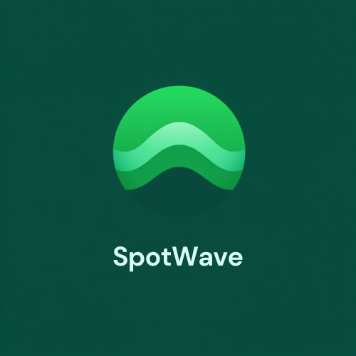

<div align="center">
  
  <h1>SpotWave</h1>
  <p><strong>Experience Music with Intelligence.</strong></p>
</div>

[](https://spot-wave.vercel.app/)

SpotWave is a premium music exploration platform that transforms your Spotify library into an intelligent, interactive experience. Beyond standard playback, SpotWave leverages AI and high-end design to help you discover, organize, and engage with your music like never before.

---

## ✨ Key Features

### 🤖 AI-Powered Intelligence

- **Gemini AI Recommendations**: Get personalized track suggestions and creative quiz ideas powered by Google's Gemini AI.
- **Intuitive Playlist Generation**: Smart analysis of your listening habits and genres to suggest creative playlist names and descriptions.
- **Genre Analysis**: Deeper insights into your library with automated genre categorization.

### 🎮 Interactive Experience

- **Music Quizzes**: Test your knowledge with multiple game modes, including Artist Quizzes, Playlist-based challenges, and Liked Song trivia.
- **Reactive Visualizer**: A stunning, real-time audio visualizer that pulses and reacts to your music using the Web Audio API.
- **Lyrics Integration**: Synced lyrics support for an immersive singing experience.

### 💎 Premium User Interface

- **Dynamic Layouts**: Seamlessly toggle between high-density Table views and beautiful Grid cards across Playlists, Artists, and Profiles.
- **Fully Responsive Tables**: Optimized column widths and smart truncation (ellipsis) for a perfect experience on mobile, tablet, and desktop.
- **Glassmorphic Design**: A modern, dark-themed aesthetic with vibrant gradients and smooth micro-animations.

### 📂 Complete Library Management

- **Seamless Profile Sync**: View your Spotify library, followed artists, and public playlists in one unified dashboard.
- **Direct Discovery**: explore top global tracks, hidden gems via Categories, and detailed Artist/Album profiles.

---

## 🛠️ Technology Stack

| Category       | Tools                                                                                                                          |
| :------------- | :----------------------------------------------------------------------------------------------------------------------------- |
| **Frontend**   | [Next.js](https://nextjs.org/), [React](https://reactjs.org/), [TypeScript](https://www.typescriptlang.org/)                   |
| **Styling**    | [Tailwind CSS](https://tailwindcss.com/), [Shadcn UI](https://ui.shadcn.com/), [Framer Motion](https://www.framer.com/motion/) |
| **AI/ML**      | [Google Gemini API](https://ai.google.dev/), [Last.fm API](https://www.last.fm/api)                                            |
| **Music Data** | [Spotify Web API](https://developer.spotify.com/documentation/web-api/)                                                        |
| **Visuals**    | [Lottie React](https://github.com/LottieFiles/lottie-react), Web Audio API                                                     |
| **Deployment** | [Vercel](https://vercel.com/)                                                                                                  |

---

## 🚀 Getting Started

### Prerequisites

- A **Spotify Premium** account (required for playback via Spotify SDK).
- Node.js installed on your machine.

### Installation

1.  **Clone the repository:**

    ```bash
    git clone https://github.com/Aiyern30/SpotWave
    cd SpotWave
    ```

2.  **Install dependencies:**

    ```bash
    npm install
    ```

3.  **Setup Environment Variables:**
    Create a `.env.local` file in the root directory and add your credentials:

    ```env
    NEXT_PUBLIC_LASTFM_API_KEY=your_lastfm_key
    GEMINI_API_KEY=your_gemini_key
    NEXT_PUBLIC_SPOTIFY_CLIENT_ID=your_spotify_client_id

    # Add other required Spotify credentials
    ```

4.  **Run the development server:**

    ```bash
    npm run dev
    ```

5.  **Open the app:**
    Navigate to [http://localhost:3000](http://localhost:3000)

---

## 🤝 Contributing

We welcome contributions! If you have ideas for new features or improvements:

1. Fork the Project
2. Create your Feature Branch (`git checkout -b feature/AmazingFeature`)
3. Commit your Changes (`git commit -m 'Add some AmazingFeature'`)
4. Push to the Branch (`git push origin feature/AmazingFeature`)
5. Open a Pull Request

---

## 📜 License

Distributed under the MIT License. See `LICENSE` for more information.

---

_Made with ❤️ by the SpotWave Team._
